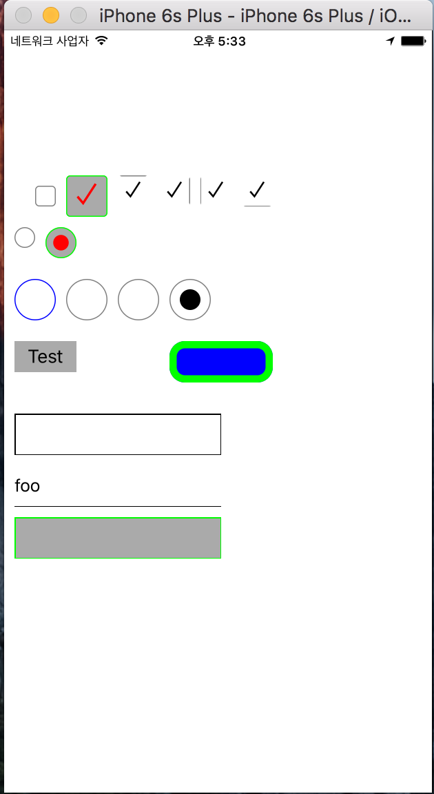
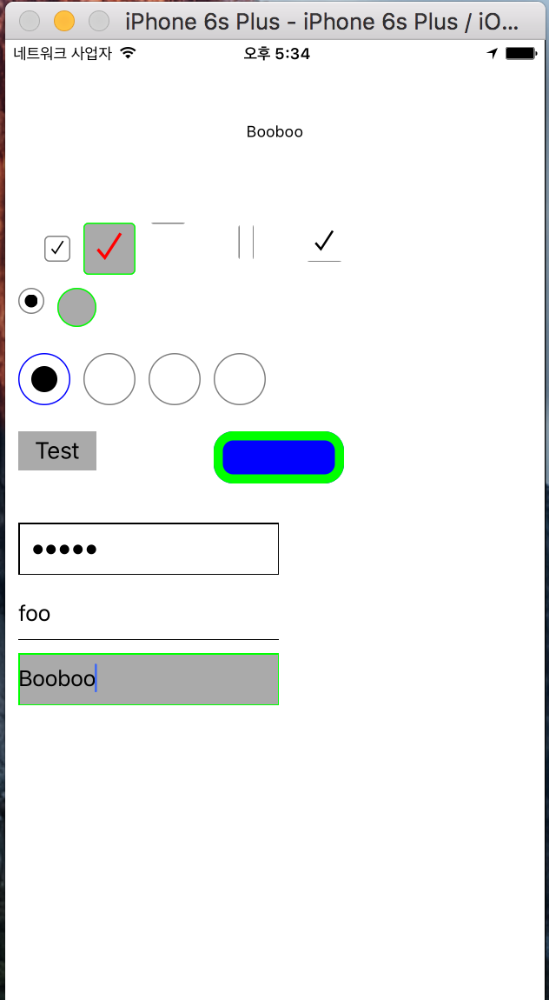

# InputTag

[](https://travis-ci.org/pikachu987/InputTag)
[](http://cocoapods.org/pods/InputTag)
[](http://cocoapods.org/pods/InputTag)
[](http://cocoapods.org/pods/InputTag)

## Example

To run the example project, clone the repo, and run `pod install` from the Example directory first.

## Requirements

## Installation

InputTag is available through [CocoaPods](http://cocoapods.org). To install
it, simply add the following line to your Podfile:

```ruby
pod 'InputTag', '~> 0.1.3’
```

## Example
~~~~
/*
<input type="checkbox">
InputTag().getCheckBox(
frame : CGRect,
checked : Bool,
backgroundColor : UIColor,
color : UIColor,
borderColor : UIColor,
rectEdge : UIRectEdge
)
*/

let checkBox1 = InputTag().getCheckBox(CGRect(x: 30, y: 150, width: 20, height: 20))
let checkBox2 = InputTag().getCheckBox(CGRect(x: 60, y: 140, width: 40, height: 40), checked: true, backgroundColor: UIColor.lightGrayColor(), color: UIColor.redColor(), borderColor: UIColor.greenColor())

//callback Function
checkBox1.callBack { (_) in

}

/*
<input type="radio">

InputTag().getRadio(
frame : CGRect,
name : String, 
value : AnyObject, 
selected : Bool, 
backgroundColor : UIColor, 
color : UIColor, 
borderColor : UIColor, 
rectEdge : UIRectEdge
)
*/


let radio1 = InputTag().getRadio(CGRect(x: 10, y: 190, width: 20, height: 20), name: "foo", value: "radio1", selected: true)
let radio2 = InputTag().getRadio(CGRect(x: 40, y: 190, width: 30, height: 30), name: "foo", value: "radio2", selected: true, backgroundColor: UIColor.lightGrayColor(), color: UIColor.redColor(), borderColor: UIColor.greenColor())

InputTag.radioAdd(radio1)
InputTag.radioAdd(radio2)

radio1.callBack { (element) in

}

/*
<input type="button">

InputTag().getButton(
frame : CGRect,
title : String,
backgroundColor : UIColor,
color : UIColor,
borderColor : UIColor,
borderWidth : CGFloat,
borderRadius : CGFloat,
rectEdge : UIRectEdge
)
*/

let button1 = InputTag().getButton(CGRect(x: 10, y: 300, width: 60, height: 30),title: "Test")
let button2 = InputTag().getButton(CGRect(x: 160, y: 300, width: 100, height: 40), backgroundColor: UIColor.blueColor(), color: UIColor.redColor(), borderColor: UIColor.greenColor(), borderWidth: 7, borderRadius: 15)
button1.callBack { (_) in

}


/*
<input type="text">

InputTag().getText(
frame : CGRect,
ctrl : UITextFieldDelegate,
value : String,
backgroundColor : UIColor,
color : UIColor,
borderColor : UIColor,
borderWidth : CGFloat,
borderRadius : CGFloat,
rectEdge : UIRectEdge
)
*/


let text1 = InputTag().getText(CGRect(x: 10, y: 370, width: 200, height: 40), ctrl: self)
let text2 = InputTag().getText(CGRect(x: 10, y: 420, width: 200, height: 40), ctrl: self, value: "foo", rectEdge: .Bottom)

text1.setPassword()
text1.setLeftPadding()
text1.setRightPadding()
text1.maxLength(5)

text1.callBack { (_) in

}
text1.editCallback { (element) in

}


~~~~


##Image

###Test1 Image


###Test2 Image



## Author

pikachu987, pikachu987@naver.com

## License

InputTag is available under the MIT license. See the LICENSE file for more info.
